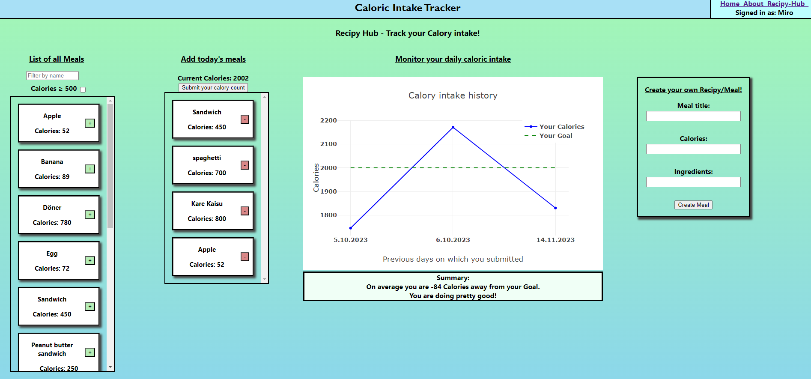

# :bento: Meal Tracker Web App

## Table of Contents

- [Introduction](#introduction)
- [Features](#features)
- [Technologies](#technologies)
- [Getting Started](#getting-started)
- [Usage](#usage)
- [Screenshots](#screenshots)
- [Contributing](#contributing)
- [License](#license)

## Introduction

The Meal Tracker Web App is a full-stack application designed to help users track their daily caloric intake by logging their consumed meals and recipes. This app is built using the MERN stack, consisting of MongoDB, Express, React, and Node.js. It offers an intuitive user interface for managing meals and visualizing calorie consumption.

## Features

- User Authentication: Register and log in to access personalized meal tracking.
- Meal Logging: Easily add, edit, and remove meals and recipes.
- Calorie Tracking: Record the calorie content for each meal.
- Daily Summaries: Track your daily calorie intake and view a summary.
- Graph Visualization: Visualize your caloric intake over time using interactive charts.

## Technologies

- **Frontend**: React
- **Backend**: Node.js, Express.js, MongoDB, Mongoose
- **Authentication**: JSON Web Tokens (JWT)
